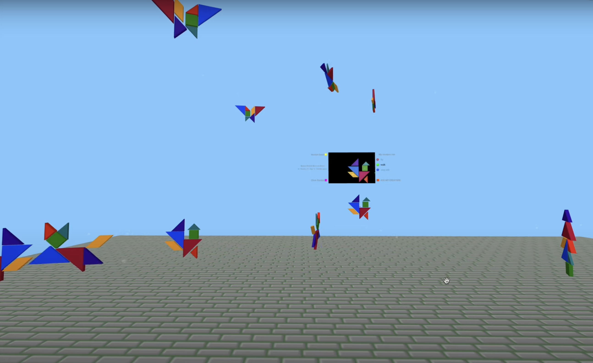

Final Documentation (Dec. 20, 2022)
-----------------------------------

## [➡️ PLAY NOW](https://hainuochen.hosting.nyu.edu/newport/vrTangramGardenFolder/3Dnewnewnew/index.html)
*Use Firefox or Safari for the best result. May take a while to load*

#### I created the Tangram Garden as my final project for the Interactive Computing Class. The user can use the 2D easel to make 3D tangram creatures, which can be added to the garden and move (or not) according to their attributes.

  
  

### Making the Project

  

#### 

*   **2D Tangram** 
    *   <ins>Tangram pieces</ins>: I created each 2D tangram piece from scratch by calculating their sizes, positions, etc., which is somehow unnecessary because using png images would be much easier.
      
    *   <ins>Rotation feature: Instead of rotating the piece every time the R key is pressed, I set the pieces in constant rotation mode and the key press changes the rotation angle only.
      
  
*   **3D Tangram**
    *   <ins>3D models</ins>: I created 3D pieces in TinkerCad and exported them as OBJ files.
      
    *   <ins>Connecting 2D & 3D pieces</ins>: The 2D easel buffer communicates with the 3D garden through the intersection info within the overFunction. To connect specific 2D & 3D pieces, I made all of them global variables and gave them IDs, so that each 2D piece can connect to its own 3D piece accordingly.
 
  
*   **3D Tangram in the Garden**
    *   <ins>Add the creature to the garden</ins>: Originally my idea was to make a whole new set of the easel and 3D pieces every time the user creates a new creature. However, based on the code I have already written, I decided to make a new copy of the original container every time the user creates a creature. With this mechanism, the later moving of the 2D pieces will not affect the existing container copies, and the user can add the same creature to the world as many times as they want. To make the garden more organized, I put the static creatures on the right side of the garden and the walking creatures on the left, so they are unlikely to run into and through each other.
      
    *   <ins>Buttons</ins>: The user can reset the easel and clear the garden; they can also determine the attribute of their creature: whether it can stay still, walk around, or fly in the sky. The creatures will then be categorized into different arrays and move accordingly.
      
    *   <ins>Rotation & Fluctuation</ins>: Based on the Shark with Heading example Professor Kapp shared with me, I used the Perlin noise to make the creatures (the container copies) rotate and fluctuate following a transparent sensor within the container. This makes the whole garden look more lively.

  

### Future Development

  

*   **Flip feature**: The flip feature was made especially for the yellow quad piece. On the 2D buffer, the piece is flipped by reversing the X position of every point of the 2D piece, while in the 3D world, the flip is made possible by spinZ( ). It is sometimes a bit off. I would like to fix this in future development.
  
*   **Creature interaction**: If I have the chance to make this a bigger project, I would like to make the creatures interact with each other like in an ecosystem, and the users can customize the attributes of their creatures to make their collections of creatures, kind of like pokemon.
  
*   It is oddly satisfying to turn my weird childhood fantasies into a VR project, and I am surprised but proud to be able to build this whole project by myself, with advice from Professor Kapp. Never thought CS was for me but now I can say that I do coding.
  

  
  
  
  

Update #2 (Dec. 07, 2022)
-------------------------

#### For now the [2D tangram](2Dtangram/index.html) part is finished, and it works well on the [buffer in the VR world](3Dtangram/index.html) .  

 

Yet the mouse position in the buffer is not accurate (i.e. mouseX & mouseY is not where I clicked on the buffer). I am not sure how to fix this, so I made a small ellipse functioning as the mouse on the buffer. The next step would be to connect the 2D shapes with 3D shapes, so that they can move and rotate together. I also need to save the 3D artwork and move around in the VR world.  
  

Update #1 (Nov. 30, 2022)
-------------------------

#### I decided to make the final program into VR via a frame. The user should be able to assemble their tangram on a 2D buffer, and VR connects to that buffer and brings the art to the 3D world.  
  
So far I have figured out how to move one piece of tangram shape around and rotate it in 2D. The next step is to make the whole set of tangrams work in 2D.  
  
I have also found a way (TinkerCAD) to create 3D geometric figures for my program. 

The next step is to connect the 2D shapes in the buffer and the 3D shapes in VR. In the future I need to make the 3D figures move around in the garden.  
  
  
  

PROPOSAL (Nov. 21, 2022)
------------------------

#### For the final project, I would like to use AR to enable the user to create a garden. Basically, the user assembles objects by using tangrams on the phone. The webcam recognizes the piece and adds it into the garden. The garden will be filled with tangram animals, plants, houses, decorations etc.  
  
Tangram is a traditional Chinese toy that consists of 7 flat polygons with different colors. As a kid I loved making abstract animals with tangram, and I thought it must be funny to see these weird looking animals actually running around.  

  
First, I will need to make a webpage in which the user can assemble tangrams on their phone. There will be 7 polygons, and the user should be able to drag them around, change their directions, and assemble them together. The users can either assemble according to a sample, or create their own masterpiece. They will also need to categorize their work as animals, plants, houses, decorations or whatever.  
  
Second, I will need to make the webcam recognize the piece. Since each polygon has a different color and shape, the webcam should be able to detect them based on their color and shape. The webcam should also recognize the category that the user picked.  
  
Finally, I will need to add the object into the garden. If the webcam recognizes the object as a plant or house, it should not move; if it's an animal or butterfly, it should move or fly around.  
  
I also have some concerns. So far I have no idea how the webcam and recognition work. Besides, I am not sure how 2D tangram art may look in the garden. Should I make them look more real and lively by making them 3D? Not sure how to do this either.
