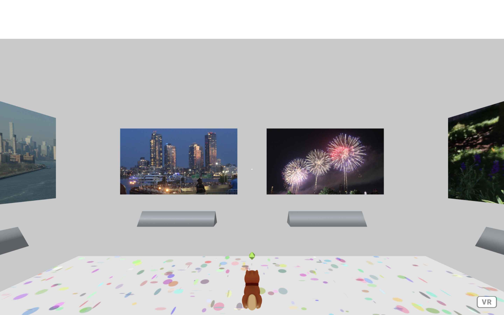
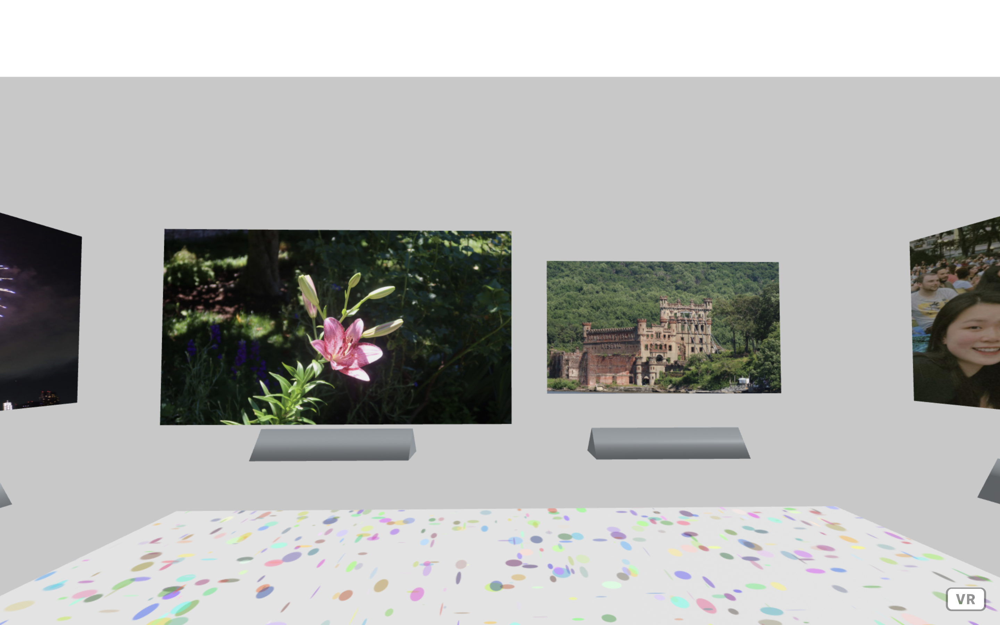

## VR Gallery Documentation (Nov.28, 2022)

## [➡️ PLAY NOW](https://hainuochen.hosting.nyu.edu/vrGalleryFolder/index.html)

* This is an assignment for the Interactive Computing Class. I made a mini VR photo exhibition to show the memories of my last summer. It may take a while to load.

   
 
* Music will be played once the user enters the gallery. There is a small white sphere that helps user locate in the center. The user can use mouse to move around to view the photos. There are 8 photos in total all created by Object Oriented Programming (OOP).

  
  
* The floor connects to a buffer therefore renders dynamic texture. Inside the gallery, the user can enlarge the photo by hovering the mouse on it. Hope you enjoy my mini exhibition.

  
