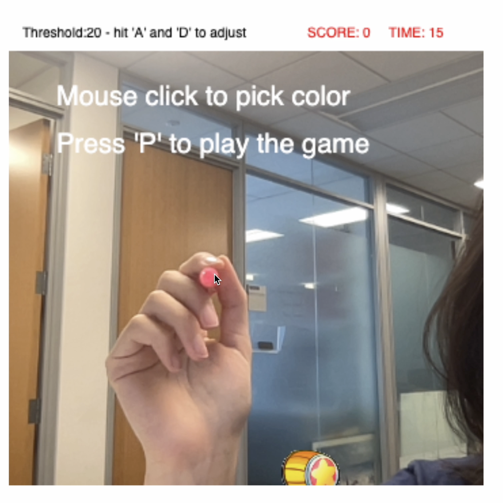

## AR Whack-A-Mole Documentation (Dec. 12, 2022)

## [➡️ PLAY NOW](https://hainuochen.hosting.nyu.edu/arWhackFolder/index.html)

This is an assignment for the Interactive Computing Class. I made an AR Whack A Mole game based on color tracking. It requires access to your web camera.

* The user can pick a color by clicking on the live video. The picked color's rgb values are stored as global variables. The program goes through all the pixels and checks which ones are close enough to the picked color. A threshold is set and can be modified by the user to determine how close is close enough. The locations of these pixel are stored and averaged to keep a stable track of the color.

* In this game, the hammer appears on the averaged location, and the user's goal is to move the hammer around to whack as many mole as possible in 15 seconds. The mole pops up and disappears in one of the 16 blocks on a certain rate. The user can press P to start the game and press R to restart the game.

 
