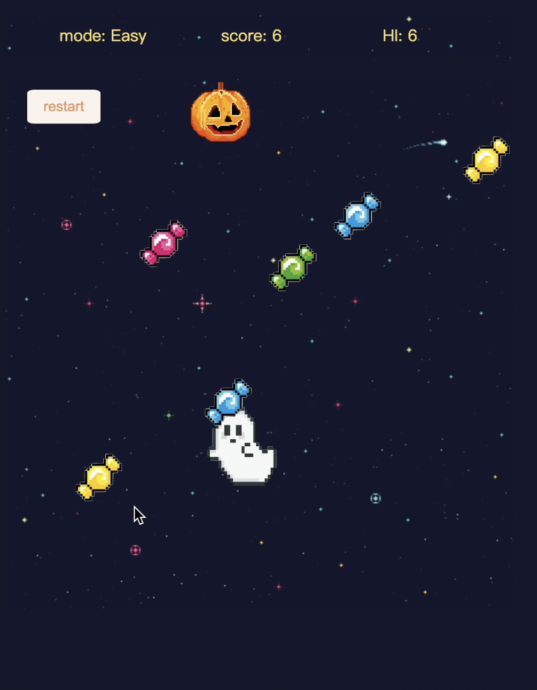
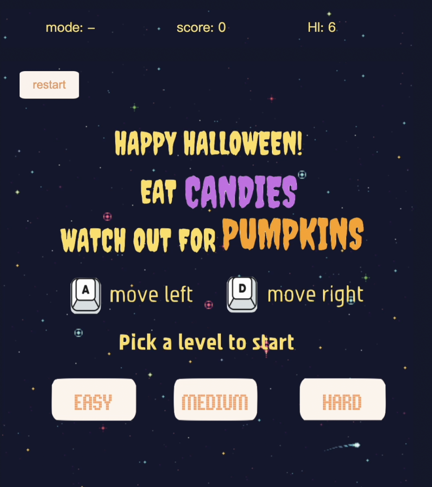
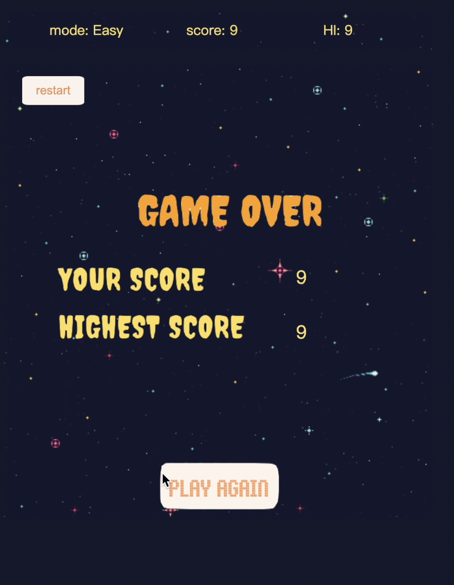

## Halloween Game Documentation (Oct.17, 2022)

## [➡️ PLAY NOW](https://hainuochen.hosting.nyu.edu/newport/halloweenFolder/index.html)

* This is an assignment for the Interactive Computing Class. I made this pixel-style vertical infinite runner game with the Halloween theme. There are three characters: Ghost, Candy, and Pumpkin. The goal is to control the Ghost to move left and right (by A & D keys), to eat as many Candies as possible, but avoid the Pumpkins at the same time. The rules are given on the initial interface of the game. Candies and Pumpkins are objects with similar functions: they drop from the top of the screen, and they disappear as soon as they hit the Ghost. For Candies, the hit means scores up, whereas for Pumpkins, the hit means game over.
  
 

* There is a simple scoreboard on the top, recording the current score and highest score. The highest score is stored in the local storage so that it can be retrieved, compared with the current score, get updated, and restored when necessary. The chosen mode is also shown on the scoreboard. The user can pick the mode on the initial interface of the game. There are 3 modes: easy, medium, and hard, with increasing dropping speed of the Pumpkins.
  
 
 
* If the game is over, the users score and the highest score are shown on the screen. The user can play the game again by clicking the play button. If the user wishes to restart the game in the middle of the game, they can always click the restart button on the upper left corner to come back to the initial interface. Different sounds are add to play when hit Candies, Pumpkins, and click bottons as well.
  
  
